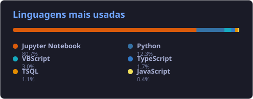

<!-- Header Animado -->
<h1 align="center">
  
</h1>

  Bem-vindo(a) ao meu perfil do GitHub! Sou estudante de Engenharia de Computação na FIAP, futuro pós-graduando em Engenharia de Dados e apaixonado por tecnologia.

  

---

### 📊 Minhas Estatísticas de Atividade

  
   
  

---

### 🚀 Sobre Mim
Sempre fui fascinado pelo ecossistema tecnológico, hardware e pela engenharia que faz os dispositivos funcionarem. Desde muito jovem, minha curiosidade me impulsionava a entender a mecânica interna das coisas ao invés de apenas consumi-las, o que me motivou a estudar engenharia reversa em softwares e jogos na minha adolescência. 

Atualmente, curso **Engenharia de Computação pela FIAP**, além de expandir constantemente meu repertório técnico com formações em Data Science e Análise de Dados pela **Alura** (ambas pertencentes ao mesmo grupo educacional). 

Tenho experiência profissional prática iniciada logo no primeiro ano de graduação na área de dados, o que consolida o meu plano de carreira já direcionado para a **Pós-Graduação em Engenharia de Dados**.

---

### 🛠️ Hard Skills & Conhecimento Técnico

#### ⚡ Engenharia Eletrônica, Robótica & IoT
* **Eletrônica e Hardware:** Desenvolvimento com base sólida técnica adquirida em eletrônica no SENAI. Domínio em análise analógica e digital de circuitos complexos, potencial elétrico e sistemas embarcados.
* **Projetos de IoT:** Desenvolvimento e simulação usando plataformas como **Arduino** e **ESP32**, projetando placas e circuitos usando **KiCad**, **Proteus**, **Tinkercad** e diagnóstico com osciloscópios.
* **Sistemas Físicos:** Integração de sensores industriais e biomédicos de telemetria, modelagem de atuadores e controle mecânico.

#### 📊 Engenharia de Dados, Big Data & BI
* **Estrutura de Dados & Bancos:** SQL / T-SQL avançado (joins, CTEs, Views, DDL/DML, truncate). Modelagem dimensional (Tabelas Fato e Dimensão, controle de histórico com SCD/Slowly Changing Dimensions) e Data Mining.
* **Visualização de Dados:** Excel (VBA / Conexões ODBC) e Power BI avançado (linguagem DAX, Power Query / M).
* **Processamento e Big Data:** Projetos arquitetados com Hadoop, Apache Sqoop, Databricks, Microsoft Fabric, Azure e Git / Azure DevOps.

#### 🐍 Programação & Inteligência Artificial
* **Python (POO Avançado):** Arquiteturas de código orientadas a objetos, classes, subclasses, herança, encapsulamento, getters/setters e estruturas de dados complexas como árvores binárias.
* **Inteligência Artificial:** Desenvolvimento de sistemas e prompts avançados utilizando as principais LLMs. Conectividade e orquestração de **Agentes e Subagentes de IA**, AI Harness e implantação do protocolo **MCP (Model Context Protocol)**.
* **Outras Linguagens:** RStudio, Kotlin, JavaScript, CSS, HTML, Qiskit (Computação Quântica), C++ (Arduino), Assembly (Sistemas Operacionais) e Java.
* **Desenvolvimento Mobile:** Criação de aplicações com foco em React Native estruturando componentização e interfaces funcionais para Android e iOS.

#### ⚙️ Metodologias & Qualidade
* Certificação **Yellow Belt Lean Six Sigma** aplicada à melhoria contínua de rotinas e processos.
* Coordenação e gestão de cronogramas ágeis utilizando **Metodologias Ágeis**.

> [!NOTE]
> *Utilizo o ecossistema Big Data e Cloud (Hadoop, Apache Sqoop, Oracle Cloud) para engenharia de dados escalável.*

---

### 🧠 Projetos de Destaque

#### 🦿 Exoesqueleto com Interface Cérebro-Máquina (Hospital Oswaldo Cruz)
* **Desenvolvimento de Hardware e Firmware:** Criei os códigos em C/C++ para Arduino e realizei a calibração de sensores biomédicos para integração com uma Interface Cérebro-Máquina (Brain-Machine Interface) utilizando o headset Neurosky.
* **Processamento de Dados e Telemetria:** Desenvolvi o sistema de captura de dados de força de movimento do paciente em tempo real, enquanto a interface cérebro-máquina mensurava o esforço físico e a exaustão mental do paciente.
* **Analytics para Tomada de Decisão:** Desenvolvi os relatórios analíticos extraídos a cada sessão de reabilitação. Esses dados permitiram à equipe médica avaliar a evolução clínica quantitativa do paciente e calibrar a intensidade ideal da terapia física.

📄 **Aprofunde-se tecnicamente neste projeto acessando a documentação científica:**
* [NeuroSky & Circuitos Digitais: Delimitação Lógica da Solução](./oswaldo-cruz-docs/digital_circuits_neurosky.md)
* [Estudo de Física: Balança de Precisão e Células de Carga (HX711)](./oswaldo-cruz-docs/physics_scale_hx711.md)
* [Internet das Coisas (IoT): Protocolo MQTT na Indústria 4.0](./oswaldo-cruz-docs/iot_mqtt_industry.md)
* [Design Mecânico: Concepção do Robô Auxiliar e Modelagem 3D (CAD)](./oswaldo-cruz-docs/robotics_oswaldo_cruz.md)

#### 🏆 Projeto Sanofi Challenge (FIAP)
* **Inteligência Artificial e Automação:** Algoritmos de NLP e Visão Computacional para leitura e detecção de padrões em documentos médicos (planilhas FMV e agendas), garantindo compliance com as políticas da Sanofi.
* **Assistentes Virtuais & GenAI:** Chatbots integrados a IAs Generativas (ChatGPT, Gemini e IBM Watson) para triagem de SAC de drogarias e automação de conteúdos de treinamento.
* **Alta Disponibilidade e Multithreading:** Modelagem de servidor multithread otimizado para processadores de 16 cores, dimensionado para suportar até **30.000 requisições por segundo**.
* **Big Data e Cloud:** Pipeline de dados no ambiente **Oracle Cloud**, utilizando **Apache Sqoop** para ingestão e **Hadoop (HDFS)** para processamento e estruturação de Data Lake.
* **Front-end & Mobile:** Transposição de plataforma web responsiva para aplicativo mobile nativo utilizando **React Native**.

---

### 📚 Resolvendo Desafios Acadêmicos (FIAP Challenges)
Como estudante de Engenharia de Computação, documentei e publiquei as resoluções técnicas completas dos Challenges desenvolvidos em parceria com o **Hospital Alemão Oswaldo Cruz**:

*   📘 **2022 - SPRINT 1:** [Resolução completa de Matemática, Circuitos Digitais e Indústria 4.0 (Ergonomia/Exoesqueleto)](./fiap-challenges/2022_sprint1_resolucao.md)
*   📘 **2022 - SPRINT 3:** [Resolução de Física (Mecânica e Torque), Otimização Matemática (Cálculo Diferencial) e Controle de Motor de Passo sem Biblioteca (Arduino C++)](./fiap-challenges/2022_sprint3_resolucao.md)

---

### 💻 Minhas Conexões Técnicas

  

---

  <i>"Transformando dados em inteligência e código em soluções de alto impacto."</i>

