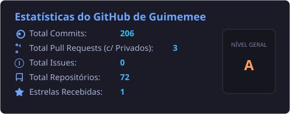

<!-- Header Animado -->
<h1 align="center">
  
</h1>

  Bem-vindo(a) ao meu perfil do GitHub! Sou estudante de Engenharia de Computação na FIAP, futuro pós-graduando em Engenharia de Dados e apaixonado por decifrar o funcionamento das tecnologias.

  

---

### 🚀 Sobre Mim
Sempre fui fascinado por hardware, computação e eletrônica. Desde cedo, minha curiosidade me impulsionava a entender como as coisas funcionavam por trás dos panos (o que me levou a fazer engenharia reversa em jogos e criar meus próprios cracks na adolescência). 

Após me formar como **Técnico em Eletrônica pelo SENAI**, ingressei na faculdade de **Engenharia de Computação (FIAP)** e conquistei minha primeira oportunidade de mercado como **Engenheiro de Dados** logo no primeiro ano. Por conta dessa rápida ascensão e foco, já possuo minha especialização programada em Engenharia de Dados. 

Minha principal especialidade está em **Engenharia de Dados, Data Science e Machine Learning**, mas meu escopo técnico se estende a desenvolvimento **Full-Stack, Mobile e Automação Industrial**.

---

### 🧠 Projetos de Destaque

#### 🦿 Exoesqueleto com Interface Cérebro-Máquina (Hospital Oswaldo Cruz)
* **Desenvolvimento de Hardware e Firmware:** Criei os códigos em C/C++ para Arduino e realizei a calibração de sensores biomédicos para integração com uma Interface Cérebro-Máquina (Brain-Machine Interface).
* **Processamento de Dados e Telemetria:** Desenvolvi o sistema de captura de dados de força de movimento do paciente em tempo real, enquanto a interface cérebro-máquina mensurava o esforço físico e a exaustão mental.
* **Analytics para Tomada de Decisão:** Desenvolvi os relatórios analíticos extraídos a cada sessão de reabilitação. Esses dados permitiram à equipe médica avaliar a evolução clínica quantitativa do paciente e calibrar a intensidade ideal da terapia física.

#### 🏆 Projeto Sanofi Challenge (FIAP)
* **Inteligência Artificial e Automação:** Algoritmos de NLP e Visão Computacional para leitura e detecção de padrões em documentos médicos (planilhas FMV e agendas), garantindo compliance com as políticas da Sanofi.
* **Assistentes Virtuais & GenAI:** Chatbots integrados a IAs Generativas (ChatGPT, Gemini e IBM Watson) para triagem de SAC de drogarias e automação de conteúdos de treinamento.
* **Alta Disponibilidade e Multithreading:** Modelagem de servidor multithread otimizado para processadores de 16 cores, dimensionado para suportar até **30.000 requisições por segundo**.
* **Big Data e Cloud:** Pipeline de dados no ambiente **Oracle Cloud**, utilizando **Apache Sqoop** para ingestão e **Hadoop (HDFS)** para processamento e estruturação de Data Lake.
* **Front-end & Mobile:** Transposição de plataforma web responsiva para aplicativo mobile nativo utilizando **React Native**.

---

### 🛠️ Hard Skills & Tecnologias

#### 📊 Engenharia de Dados & Big Data
* **Bancos de Dados:** SQL / T-SQL (Joins avançados, CTEs, Views, DDL/DML, Truncate, Dictionaries).
* **Data Warehousing & BI:** BigQuery, modelagem dimensional (Tabelas Fato e Dimensão, controle de histórico com SCD/Slowly Changing Dimensions).
* **Ferramentas e Pipelines:** Hadoop, Apache Sqoop, Datamining, Azure, Databricks, Git / Azure DevOps.
* **Visualização de Dados:** Power BI avançado (linguagem DAX, Power Query / M, conexões ODBC), Microsoft Fabric.

#### 🐍 Programação & Inteligência Artificial
* **Python Avançado (POO):** Classes, subclasses, encapsulamento, herança, getters/setters, estruturas de dados como árvores binárias.
* **Estrutura de Agentes de IA:** Domínio de arquiteturas baseadas em Agentes de IA, Subagentes, AI Harness, LLMs e protocolos como **MCP (Model Context Protocol)**.
* **Desenvolvimento Full-Stack & Mobile:** React Native (desenvolvimento mobile com componentização e navegação de telas), HTML5, CSS3, JavaScript.

#### ⚙️ Automação, Corporativo & Processos
* **Microsoft Power Platform:** Power Apps (Model-driven / Canvas), Power Automate, Dataverse, Power Platform Agents, Excel (VBA/ODBC).
* **Sistemas Integrados (ERP):** SAP avançado.
* **Melhoria de Processos:** Certificação Yellow Belt Lean Six Sigma e Metodologias Ágeis.

---

### 💻 Minhas Conexões Técnicas

  

---

### 📊 Estatísticas (Estatísticas Ativas)

  
   
  

---

  <i>"Transformando dados em inteligência e código em soluções de alto impacto."</i>

